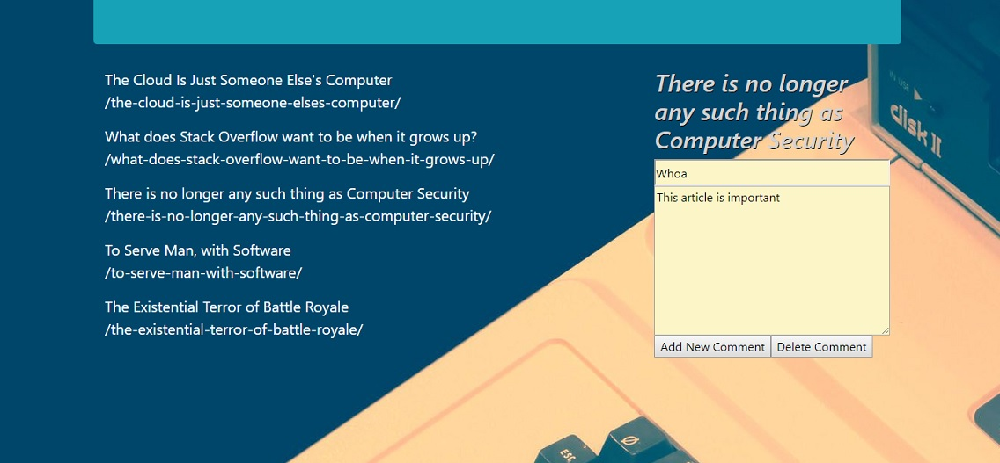

# A 'Scrape-Tastic' Tech Article Site
___

For this application, the task presented was to use scraping skills to, you guessed it, scrape a web page (in a very minimal and nice way), that would allow the user to view the scraped article headlines, click a headline to expand and read the article, add and edit comments, and then saving both the links and comments to a Mongo database.  The inclusions and required packages used in this project were Express JS, Express Handlebars, MongooseDB, Cheerio and Axios calls.  Also, other technologies used were HTML, JavaScript, and jQuery to bring the page together on the front end, and lastly, Heroku for the web hosting (link can found at the bottom of the page).

When the user loads the site, the first page they are brought to is the basic home page with no articles, links or comments available.  Then, when the user navigates to the site address'/scrape', that will initialize the scrape from a coding/humor site called "www.codinghorror.com".  Moving then back to the home page, the articles from the site will be listed on the page, and the user will then have the option to follow the link to each article, add comments that will be saved to the link in the database, and then also be able to update or delete the saved comment.  All of these, articles and comments, are saved to a database that is accessed with Robo3T DB as well.
___

___

___

The bugs encountered during this project were mainly with the hosting on heroku, and adding mongoLab details to the hosted heroku site so that it could be hosted and linked to the MongoDB properly.  Going through past project code and instructions, and chatting with a colleague, I was able to add the correct code to the server.js file, and by also adding an 'or' statement for the DB hosting allowed the site to work publicly and also, locally if necessary.  The other bugs that I came across during the project was deleting the comments after being posted, but was able to get the comments removed after looking back at past completed projects.  Otherwise, the site is able to function properly to scrape headlines and links from the outside page, render them to the home page, and give the user the ability to add, edit and remove comments.  Screenshots below will also show the 'headlines' and 'comments' route of where they are saved.
___

___

___

Update for Heroku deployment issues:

After going back and reading updated instructions for the project to be successfully deployed to heroku, below were the changes that were found:

-- Needed to install the 'dotenv' package, and require it in the server.js file.

-- Had to update the mongoose.connect code in the server.js file.

-- Also, in the command prompt, the heroku addons:create mongoLab, as well as the heroku config:get MONGODB_URI had to be ran and created.  The mongoLab URL link was already provided last night after speaking with Bryan, and that was inserted into the .env file after the mongoLab addon was installed.  However, the config:get still needed to be ran.  Screenshots will be provided below of the deployed link, and the hosted link will be resubmitted.
___

___

## Built With

* [HTML]
* [JavaScript]
* [jQuery]
* [Express JS]
* [Express Handlebars]
* [Cheerio](https://github.com/cheeriojs/cheerio) - Fast, flexible, and lean implementation of core jQuery designed specifically for the server.
* [Axios](https://www.npmjs.com/package/axios) - Promise based HTTP client for the browser and node.js
* [MongoDB]
* [Mongoose]
* [Heroku](https://infinite-earth-49673.herokuapp.com/) - For Web Hosting

## Authors

* **Matt Williams** - *Initial work* - [M Williams Portfolio](https://mattwills09.github.io/portfolio.html)
